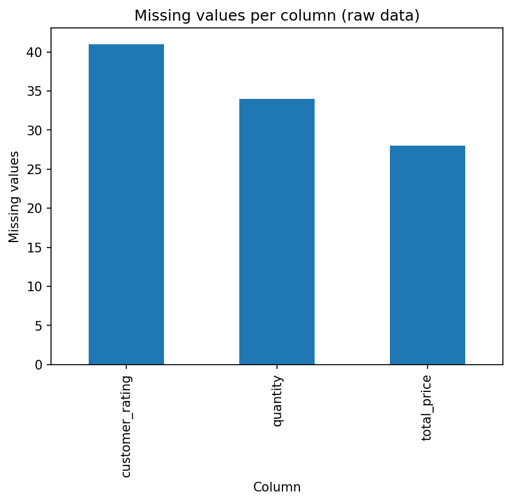
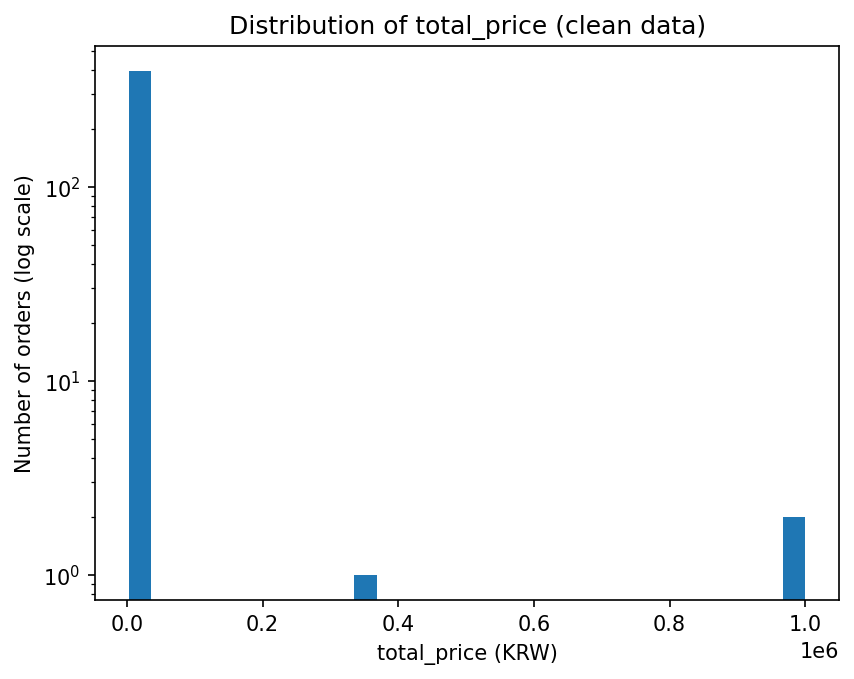
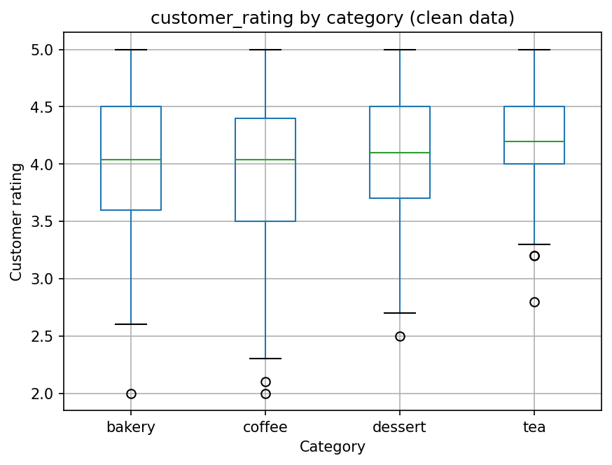

# Lab 1 리포트 — 20212788 최재원

## 1. 수행 내용

스켈레톤 코드로 되어있는 네 함수를 구현했고, 정제 절차는 명세에 적힌 다섯 단계의 순서를 그대로 따랐습니다.

스켈레톤에서 벗어난 것은 한 가지로, Figure 2의 y축을 로그 스케일로 그렸습니다.
400건 중 3건뿐인 대량 주문이 선형 축에서는 1픽셀 높이로 뭉개져 보이지 않았기 때문입니다.

IQR 규칙으로 표시된 3건은 삭제하지 않고 그대로 두었습니다.
세 건 모두 120~200잔의 대량 주문으로 입력 오류로 볼 근거가 없고, 
표시는 사람이 확인할 대상을 좁혀줄 뿐 오류를 판정하는 것이 아니기 때문이라고 봤습니다.

## 2. 결과

**표 1. `results.json`의 주요 수치.** 
전체 결측 103개 중 41개가 `customer_rating` 한 컬럼에 몰려 있다는 점이 가장 눈에 띔.

| 항목 | 값 |
|------|-----|
| 전체 행 수 (원본 / 정제 후) | 412 / 400 |
| 제거된 중복 행 | 12 |
| 결측값 (원본 → 정제 후) | 103 → 0 |
| `quantity` 이상치 (IQR, k=1.5) | 3 |
| 매출 1위 카테고리 | `coffee` (3,114,500원) |
| 평균 평점 (정제 후) | 4.037 |

원본의 결측은 세 컬럼에 몰려 있었습니다: 
`customer_rating` 41개, `quantity` 34개, `total_price` 28개.
표시된 주문 3건은 각각 120잔, 150잔, 200잔.
금액은 360,000원, 975,000원, 1,000,000원.

## 3. 그림

**그림 1. 컬럼별 결측값 개수 (원본 데이터).** 
결측은 `customer_rating`(41), `quantity`(34), `total_price`(28) 세 컬럼에만 나타나고 
`order_id`, `date`, `item`, `category`, `unit_price`, `takeout`에는 하나도 없습니다.

비어 있는 세 컬럼은 모두 주문을 처리하고 영수증을 출력하는 데 반드시 필요하지는 않은 항목이며,
그중에서도 손님에게 따로 물어야 하는 `customer_rating`이 가장 많이 비어 있습니다.

**그림 2. 정제 후 `total_price`의 분포 (y축 로그 스케일).** 
400건 중 397건이 50,000원 미만에 몰려 있고 나머지 3건이 360,000원에서 1,000,000원 사이에 따로 떨어져 있는, 
오른쪽으로 강하게 치우친 분포입니다. 

이런 모양에서는 평균(17,405원)이 중앙값(11,000원)보다 6,000원 이상 높게 나오므로,
이 컬럼을 대푯값 하나로 요약할 때는 평균보다 중앙값이 적절한 것 같습니다.

**그림 3. 정제 후 카테고리별 `customer_rating`.** 
`tea`의 상자가 가장 위에 있고 평균도 4.206으로 가장 높지만, 
`tea`는 66건으로 네 카테고리 중 관측 수가 가장 적어 이 차이를 그대로 받아들이기는 어렵습니다.
반대로 `coffee`는 178건으로 가장 많으면서 평균 3.968로 가장 낮고 상자의 길이도 가장 길어, 평가가 가장 엇갈리는 카테고리인 것 같습니다.

## 4. 해석

표시된 이상치는 오류가 아니라 대량 주문입니다.
표 1의 `quantity` 이상치 3건은 치즈케이크 150개, 라떼 200잔, 마카롱 120개로, 단가는 모두 정상 범위이고 수량만 큽니다. 
결제 시스템의 오류나 입력 실수로 보기에는 세 건 모두 `unit_price`와 `total_price`가 정확히 맞아떨어집니다.

그런데 이 3건이 전체 매출 6,962,000원 중 2,335,000원으로 33.5%를 차지합니다. 
400건 중 0.75%가 매출의 3분의 1을 만드는 셈입니다.
이 3건을 빼면 건당 평균이 17,405원에서 11,655원으로 떨어져 중앙값 11,000원과 거의 같아지는데, 
이는 그림 2에서 본 평균과 중앙값의 괴리가 정확히 이 3건 때문이었음을 보여줍니다. 
삭제 여부는 분석의 목적에 달려 있습니다. 
"평소 손님 한 명이 얼마를 쓰는가"를 묻는다면 빼는 편이 낫고, "이 카페가 얼마를 벌었는가"를 묻는다면 빼서는 안 됩니다.

이상치는 카테고리 순위도 흔듭니다. 
표 1은 `coffee`를 매출 1위로 보고하지만, 건수를 함께 보면 그 1위가 어디서 왔는지가 달라집니다.
`coffee`는 178건에 건당 17,497원이고 `dessert`는 81건에 건당 29,172원입니다.
건당 금액만 보면 `dessert`가 훨씬 비싸고, `coffee`의 1위는 단가가 아니라 주문 건수에서 나옵니다. 

3건의 이상치 중 2건이 `dessert`에 속해 있어서, 이 3건을 제외하면 `dessert`의 건당
평균은 29,172원에서 13,013원으로 절반 이하가 되고 매출 합계도 2,363,000원에서 1,028,000원으로
줄어 3위 `tea`(820,400원)와의 격차가 2.9배에서 1.25배로 좁아집니다.
`coffee`의 1위 자체는 어느 쪽으로 계산해도 유지되지만, 2위와 3위의 순위는 이상치 처리 방식에 좌우됩니다.

결측 대체의 흔적이 그림에 남아 있습니다. 
`customer_rating`의 결측 41개를 모두 4.04라는 한 값으로 채웠는데, 400건 중 약 10%가 한 지점에 몰린 결과가 그림 3에 그대로 나타납니다.
`bakery`와 `coffee`의 중앙값이 둘 다 정확히 4.04로 같습니다.
대체는 각 그룹의 평균을 4.04 쪽으로 끌어당기는데, 결측률이 높은 `coffee`(12.9%)는 3.957에서 3.968로 올라가고 
`tea`(10.6%)는 4.225에서 4.206으로 내려갑니다. 
다만 변화 폭이 모두 0.02 이하여서, 그림 3에서 보이는 `tea`와 `coffee`의 0.24 차이를 이 대체만으로 설명할 수는 없을 것 같습니다. 
대체가 실제로 왜곡하는 것은 평균보다 분산 쪽입니다.

## 5. 한계

결측이 무작위로 발생했다는 가정이 성립하지 않으면 결론이 바뀝니다. 
평점은 손님에게 따로 물어야 하는 항목이므로, 불만이 있어 낮은 점수를 주려던 손님이 응답 자체를 건너뛰었을 가능성이 있습니다. 
그렇다면 평균으로 채우는 것은 빠진 값을 실제보다 높게 메우는 셈이고, 표 1의 평균 평점 4.037은 과대추정이 됩니다. 
카테고리별 결측률이 6.2%(`dessert`)에서 12.9%(`coffee`)까지 두 배 넘게 차이 나므로 왜곡의 크기도 카테고리마다 다르며, 
그림 3의 순위가 이 가정 하나에 의존하고 있다는 뜻입니다. 
이를 확인하려면 `takeout` 비율이나 시간대가 다른지를 함께 보는 등 평점이 비어 있는 주문과 채워진 주문이 다른 점에서도 차이가 나는지 확인해야 합니다.

## AI 및 외부 코드 사용

| 도구 / 출처 | 사용한 부분 | 내가 수정하고 검증한 내용 |
|-------------|-------------|---------------------------|
| Claude (Anthropic) | pandas 문법 설명(`isna`, `sum`, 불리언 인덱싱, `groupby`, `agg`, `astype`, `.loc`), 실패한 테스트의 에러 메시지 해석, matplotlib 옵션 확인, `lab01_concepts.pdf` 내용 설명 | 네 함수의 본문은 직접 작성했다. 지적받은 버그(pandas 메서드 반환값을 대입하지 않은 것, `column` 인자를 쓰지 않은 것, 정렬 방향)는 직접 수정한 뒤 공개 테스트 6개로 검증했다. |
| Claude (Anthropic) | 리포트 작성하는 과정에서 근거 수치 검토(이상치의 매출 비중, 이상치 제외 시 카테고리별 집계, 카테고리별 결측률과 대체 전후 평균), 리포트 섹션 구성 지원 | 인용된 수치를 `results.json` 및 `src/lab01.py`의 출력과 직접 대조해 확인했다. |
