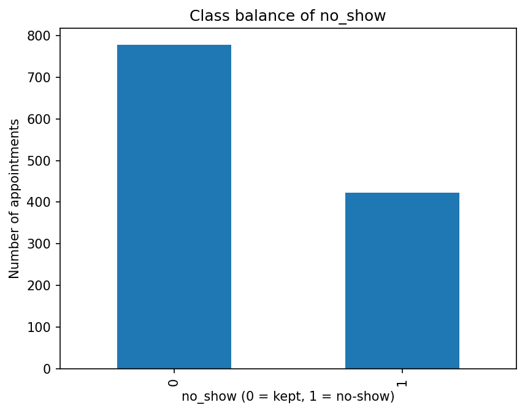
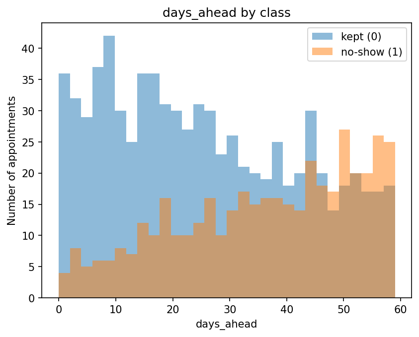
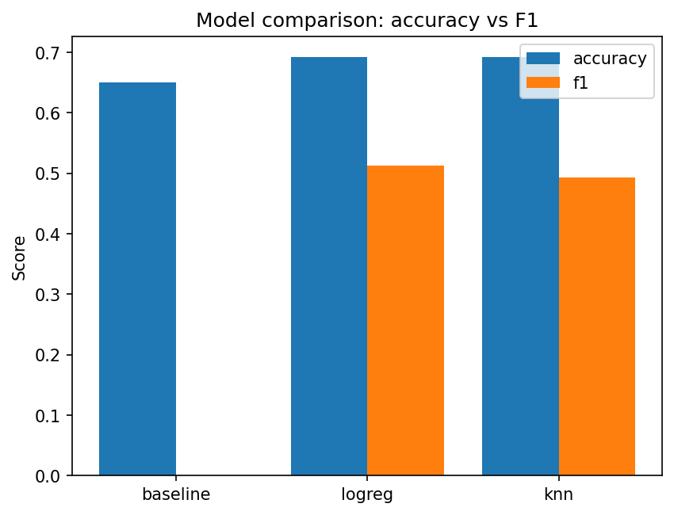

# Lab 2 리포트 — 20212788 최재원

## 1. 수행 내용

스켈레톤의 여섯 함수를 명세대로 구현했고, 스켈레톤에서 벗어난 부분은 없습니다. 분류에서는
`split_data`를 실험당 한 번만 호출해 세 모델이 같은 분할을 쓰도록 했고, 전처리는 모두
`Pipeline` 안에 넣어 `StandardScaler`가 훈련 분할에서만 fit되게 했습니다.

회귀에서는 타깃이 연속형이라 층화할 클래스가 없으므로 `split_data`를 재사용하지 않고
`train_test_split`을 `stratify` 없이 직접 호출했습니다. 그 외의 조건(시드 42, 분할 후 학습,
파이프라인 사용)은 분류와 동일하게 유지했습니다.

## 2. 결과

**표 1. 분류 결과 (검증 240건, 그중 실제 노쇼 84건).** 세 모델의 정확도 차이는 4.2%p에
불과하지만 F1은 0.0과 0.5 이상으로 갈립니다. 4절의 해석은 이 간극에 기대고 있습니다.

| 모델 | accuracy | precision | recall | F1 |
|------|----------|-----------|--------|-----|
| baseline (다수 클래스) | 0.6500 | 0.0000 | 0.0000 | 0.0000 |
| logreg | 0.6917 | 0.5735 | 0.4643 | **0.5132** |
| knn (k=15) | 0.6917 | 0.5806 | 0.4286 | 0.4932 |

**표 2. 회귀 결과 (검증 180건).** 대기 시간의 평균은 57.35분입니다.

| 모델 | MAE (분) | RMSE (분) | R² |
|------|----------|-----------|-----|
| baseline (평균 예측) | 28.4714 | 32.5750 | −0.0056 |
| linreg | **4.5140** | 5.5935 | **0.9704** |
| knn (k=15) | 6.9887 | 8.7285 | 0.9278 |

전체 1,200건 중 노쇼 비율은 0.3517이고, 층화 분할 후 훈련 0.3521 / 검증 0.3500으로 비율이
유지되었습니다.

## 3. 그림

**그림 1. `no_show`의 클래스 분포.** 정상 방문 778건에 노쇼 422건으로, 다수 클래스가 전체의
65%를 차지하는 불균형 데이터입니다. 아무것도 학습하지 않고 "전부 정상"이라고만 예측해도
정확도 65%가 나오기 때문에, 표 1에는 반드시 baseline 행이 함께 있어야 합니다.

**그림 2. 클래스별 `days_ahead` 분포.** 예약 후 10일 이내 구간에서는 정상 방문이 압도적이지만
50일을 넘어서면 노쇼가 역전하며, 평균도 정상 25.48일 대 노쇼 36.40일로 차이가 납니다. 두 분포가
크게 겹치므로 이 피처 하나로 분류할 수는 없지만, 모델이 baseline을 넘어설 수 있는 신호가 여기에
있습니다.

**그림 3. baseline / logreg / knn의 accuracy와 F1.** accuracy 막대 세 개는 높이가 거의 같아
정확도만 보면 세 모델이 비슷해 보입니다. 그러나 baseline에는 F1 막대가 아예 없는데, 이는 값이
작은 것이 아니라 정확히 0이기 때문입니다.

## 4. 해석

표 1에서 세 모델의 accuracy는 0.6500, 0.6917, 0.6917로
차이가 4.2%p뿐이고, 그림 3의 accuracy 막대만 보면 baseline도 충분히 쓸 만해 보입니다. 
그러나 baseline의 F1은 0.0입니다. 검증셋의 노쇼 84건 중 단 한 건도 찾지 못했다는 뜻이고, 65%라는
정확도는 전부 "정상"이라고 찍어서 얻은 숫자입니다. 반면 logreg는 같은 84건 중 39건을 찾아냈고
(TP 39, FN 45, FP 29), F1은 0.5132입니다. 따라서 이 결과의 정직한 서술은 "정확도 69%"가 아니라
"baseline 대비 정확도 4.2%p, F1은 0.0 대 0.5132이므로 모델은 실제로 노쇼를 찾아낸다"입니다.

accuracy가 같은 두 모델이 같은 모델은 아닙니다. logreg와 knn은 accuracy가 0.6917로 완전히
동일합니다. 이 숫자만으로는 둘을 구분할 방법이 없지만, 나머지 지표를 보면 성격이 다릅니다.
precision은 knn이 근소하게 높고(0.5806 대 0.5735), recall은 logreg가 높습니다(0.4643 대
0.4286). 실제 건수로 옮기면 logreg가 노쇼 39건, knn이 36건을 찾은 차이입니다. 어느 쪽을
택할지는 어떤 기회비용이 더 큰지에 따라 다를 것 같습니다. 
예측하지 못한 노쇼는 진료 슬롯을 그대로 비우는
반면 잘못 예측한 노쇼는 확인 연락 한 번으로 끝납니다. 
제 생각에 이 문제에서는 놓치는 쪽이 더 비싸므로
recall을, 그리고 둘을 함께 보는 F1을 기준으로 삼는 것이 타당하다고 보이고, 그 기준에서는 logreg가
앞섭니다(0.5132 대 0.4932).

회귀에서는 baseline과의 격차가 훨씬 큽니다. 표 2에서 평균 예측 baseline의 R²는 −0.0056으로
0 근처에 있습니다. 정확히 0이 아닌 것은 예측에 쓰는 평균이 훈련 행에서 계산된 값이어서
검증셋의 평균과 미세하게 다르기 때문이며, 음수라는 것은 그만큼 검증셋에서는 평균 예측보다도
조금 못하다는 뜻입니다. 
linreg는 R² 0.9704에 MAE 4.51분으로, baseline의 28.47분보다 약 6.3배
정확합니다. 분류에서 4.2%p를 다투던 것과 대조적인데, 대기 시간이 대기열 길이나 근무 인원 같은
피처와 거의 선형으로 연결되어 있기 때문으로 보입니다. 다만 R² 0.97은 평균 대비 상대적인 주장일
뿐이므로, 평균 4.5분씩 틀리는 예측이 실제 진료 현장에서 쓸 만한지는 병원이 판단해야 할 일 같습니다.

## 5. 한계

모든 수치가 시드 42의 단일 분할에서 나온 한 번의 측정입니다. 검증셋은 240건뿐이고, 표 1에서
logreg와 knn의 F1 차이 0.02는 실제로는 노쇼 3건을 더 찾았는지에 달린 크기입니다. 몇 건의
예측이 뒤집히는 것만으로 순위가 바뀔 수 있으므로, 현재 데이터로 "logreg가 knn보다 낫다"고
단정하기는 어렵습니다. 여러 시드로 분할을 반복하거나 교차검증으로 평균과 편차를 함께
확인해야 더 확실히 할 수 있고, 그 전까지는 두 모델이 비슷하다고 말하는 편이 정확한 듯 합니다.
baseline과의 격차는 그보다 훨씬 커서 이런 흔들림에 영향받지 않습니다.

## AI 및 외부 코드 사용

| 도구 / 출처 | 사용한 부분 | 내가 수정하고 검증한 내용 |
|-------------|-------------|---------------------------|
| Claude (Anthropic) | sklearn API 확인(`train_test_split`의 `stratify`, `Pipeline` 구성, `DummyClassifier`/`DummyRegressor`), 실패한 테스트의 에러 메시지 해석, matplotlib 옵션, `lab02_concepts.pdf` 내용 설명 | 여섯 함수의 본문은 직접 작성했다. 지적받은 버그(지표 반올림 누락, 0 나누기 시 int 반환, R² 괄호 위치, `run_regression_experiment`의 루프 누락)는 직접 수정한 뒤 공개 테스트 9개로 검증했다. |
| Claude (Anthropic) | 리포트 초안 작성 도움(섹션 구성, 논증 순서, 표 1·2 수치 정리, 혼동행렬 건수 계산) | 리포트 작성에 필요한 내용들을 확인한 뒤 내 문장으로 다시 썼다. 인용된 수치는 `results.json` 및 `src/lab02.py`의 출력과 직접 대조해 확인했다. |
