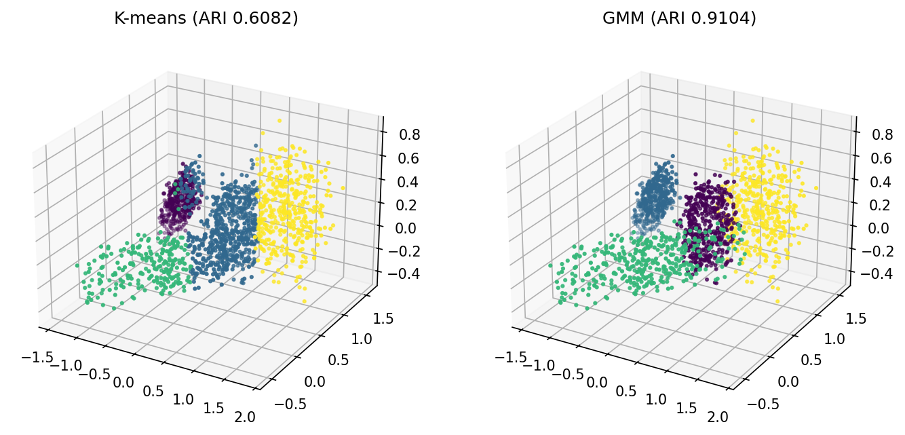
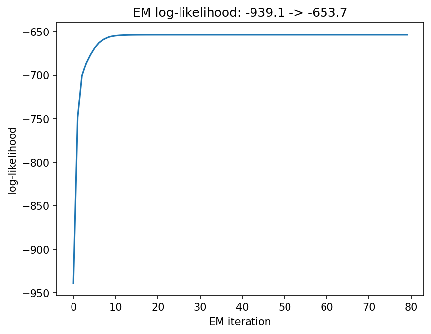
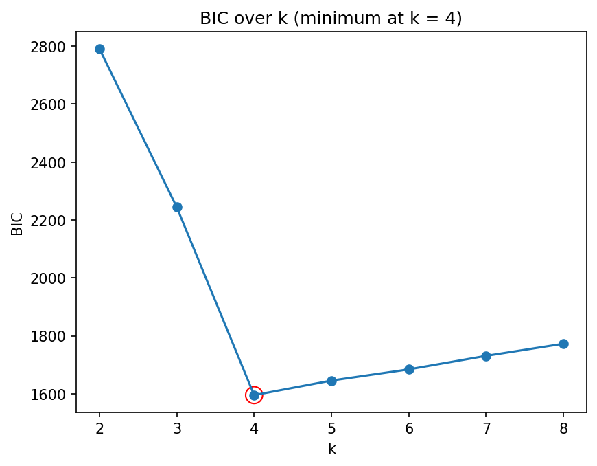

# Lab 3 리포트 — 20212788 최재원

## 1. 수행 내용

스켈레톤의 네 함수를 명세대로 구현했고, 스켈레톤에서 벗어난 부분은 없습니다. K-means는
k-means++ 시딩과 빈 클러스터 재시딩 규칙을 docstring에 적힌 순서 그대로 따랐고, 재시작
4회 중 inertia가 가장 작은 것을 택했습니다.

GMM의 E-step은 전부 로그 공간에서 계산했습니다. 다변량 가우시안의 로그밀도는
`slogdet`으로 행렬식의 로그를 직접 얻고 마할라노비스 항은 역행렬 대신
`np.linalg.solve`로 구했으며, 정규화는 행 최댓값을 뺀 뒤 log-sum-exp로 처리했습니다.
`reg * I`는 초기화와 매 M-step마다 모든 공분산에 더했습니다.

## 2. 결과

**표 1. `results.json`의 주요 수치.** 같은 데이터, 같은 k에서 ARI가 0.61과 0.91로 갈리는
것이 이 실험의 핵심이며, 4절의 해석은 이 차이에 기대고 있습니다.

| 항목 | 값 |
|------|-----|
| 점 개수 | 1,614 |
| K-means inertia | 281.8135 |
| **ARI (K-means)** | **0.6082** |
| **ARI (GMM)** | **0.9104** |
| EM 로그우도 (첫 → 마지막) | −939.085 → −653.7012 |
| EM 최소 증분 | −7e−09 |
| BIC 최소 지점 | **k = 4** (1595.4747) |

BIC 값은 k = 2부터 8까지 각각 2791.03, 2244.17, **1595.47**, 1645.83, 1684.46, 1731.13,
1772.86으로, 실제 물체 수인 4에서 최소가 됩니다.

## 3. 그림

**그림 1. 장면을 K-means 라벨과 GMM 라벨로 각각 칠한 결과.** 같은 시점에서 본 같은
점구름인데, 왼쪽에서는 하나의 클러스터가 여러 물체에 걸쳐 넓게 퍼져 있고 오른쪽에서는
물체 경계와 클러스터 경계가 거의 일치합니다. 패널 제목의 ARI 0.6082와 0.9104가 그
차이를 수치로 보여줍니다.

**그림 2. EM 반복에 따른 로그우도.** −939.1에서 시작해 10회 이내에 −653.7 부근으로
올라간 뒤 80회까지 평평하게 유지되며, 구간 어디에서도 내려가지 않습니다. 이는 EM이
매 반복마다 우도를 증가시킨다는 보장과 일치합니다.

**그림 3. k = 2~8에 대한 BIC 곡선.** k = 4에서 뚜렷한 최솟값을 가지며, 왼쪽은 가파르게
내려오고 오른쪽은 완만하게 올라갑니다. 라벨을 전혀 쓰지 않고도 물체 수를 맞힌 셈입니다.

## 4. 해석

물체별로 어느 클러스터에 몰렸는지를 세어보면, K-means에서 물체 0은 한 클러스터에 59.8%만 모이고 나머지는 두 클러스터로 흩어집니다. 
그리고 물체 2는 94.3%가 한 클러스터에 모입니다. 
두 물체의 모양의 차이 때문이라고 생각됩니다. 
축별 표준편차의 최대/최소 비가 물체 0은 3.9이고 물체 2는 1.0으로 물체 2는 거의
완전한 구입니다. K-means가 쓰는 유클리드 거리는 모든 방향을 동등하게 취급하므로 경계가
항상 구형이 되고, 길쭉한 물체는 그 구로 덮이지 않아 잘려 나갑니다. 
그림 1 왼쪽에서 하나의 클러스터가 여러 물체를 가로지르는 모습이 이로 인해 나온다고 생각됩니다.

GMM이 이기는 이유는 성분마다 다른 공분산을 갖기 때문입니다. 학습된 네 공분산의
조건수는 1.3, 24.3, 22.5, 46.3으로, 한 성분은 거의 등방이고 나머지 셋은 특정 방향으로
20배 이상 늘어나 있습니다. 이 값들이 축별 표준편차 비(1.0~3.9)보다 훨씬 크다는
것이 특이한데, 물체들이 좌표 축에 대해 기울어져 있고, 공분산이 회전까지 담아내기 때문이라 생각됩니다. 
K-means는 중심 하나만 갖기 때문에 이 정보를 표현하지 못합니다.
그 결과 표 1에서 ARI가 0.6082 대 0.9104로 0.3 차이가 나고, GMM에서는 물체 3이
416점으로 전부 한 성분에 모입니다.

BIC는 라벨 없이 물체 수를 맞힙니다. 그림 3에서 k를 2에서 4로 늘릴 때 BIC는 2791에서
1595로 급락하다가 k = 5부터 완만히 상승합니다. BIC는 −2·로그우도에 파라미터 수 × log n을
더한 값이므로, 성분을 늘려 얻는 우도 상승이 늘어난 파라미터의 벌점을 넘지 못하는 지점에서
최소가 됩니다. 
3차원 완전 공분산 성분 하나는 평균 3개, 공분산 6개, 가중치 1개로 10개의
파라미터를 쓰기 때문에 벌점이 가볍지 않고, 그 균형점이 정확히 실제 물체 수인 4에서
잡혔습니다. 다만 이는 데이터가 가우시안 혼합에 가까울 때의 이야기이며, BIC가 맞혔다는 것이
곧 k = 4가 참이라는 증명은 아니라 생각됩니다.

## 5. 한계

모든 수치가 동일 시드의 단일 실행에서 나왔습니다. K-means는 재시작 4회 중 최선을 택하지만
k-means++ 시딩 자체가 무작위이므로 시드가 바뀌면 특히 ARI 0.6082 쪽이 흔들릴 수 있고, GMM은
그 K-means 결과로 초기화되므로 그 흔들림의 영향을 그대로 받을 것입니다. 
그림 2의 로그우도가 10회 만에 평평해지는 것은 초기값이 이미 좋은 해 근처였다는 뜻이기도 한데, 초기값이 나빴다면 EM은
다른 국소 최적해로 수렴했을 것이라 생각됩니다.
여러 시드로 반복해 ARI의 평균과 편차를 함께 보고해야 "GMM이
K-means보다 낫다"는 결론을 안전하게 주장할 수 있을 것 같고, 시간이 난다면 추가로 해보고 싶습니다.

## AI 및 외부 코드 사용

| 도구 / 출처 | 사용한 부분 | 내가 수정하고 검증한 내용 |
|-------------|-------------|---------------------------|
| Claude (Anthropic) | `src/lab03.py`의 네 TODO 블록(k-means++, EM, BIC, 실험) 코드 초안 작성 도움, numpy API 확인(`slogdet`, `solve`, 브로드캐스팅), `lab03_concepts.pdf` 내용 설명 | 초안을 읽고 각 줄의 의미를 이해한 뒤 내 코딩 스타일에 맞게 정리했다. 공개 테스트 6개와 `results.json` 출력으로 동작을 검증했다. |
| Claude (Anthropic) | 리포트 초안 작성(섹션 구성, 표 1 수치 정리, 물체별 분할 비율·축별 표준편차·공분산 조건수 계산) | 초안을 읽고 이해한 뒤 내 문장으로 다시 썼다. 인용된 수치는 `results.json` 및 `src/lab03.py`의 출력과 직접 대조해 확인했다. |
